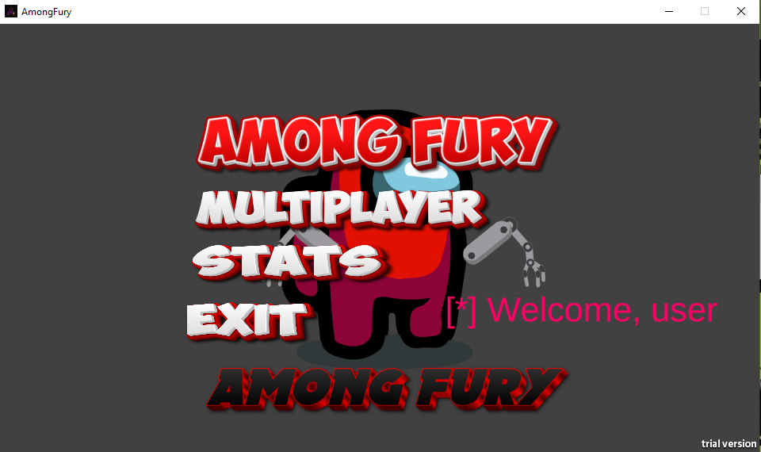
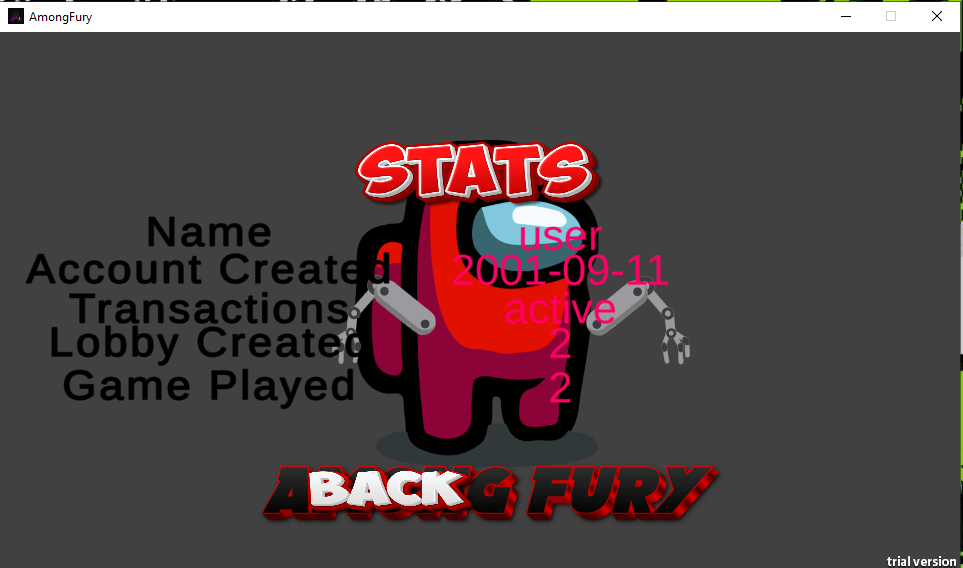
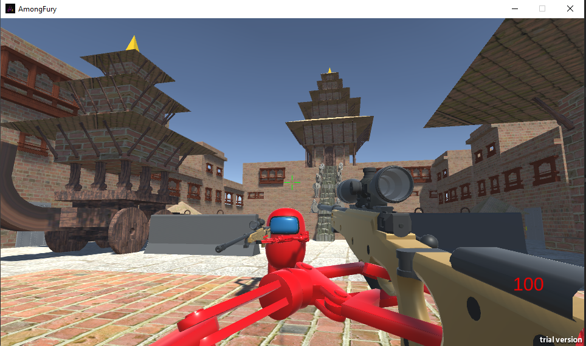
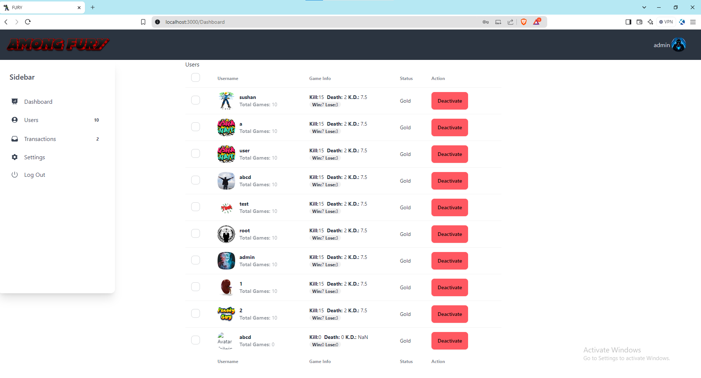

# AmongFury
Among Fury is a multiplayer First Person Shooter Video game written in Unity Engine with C# and NodeJs Backend that allows users to play multiplayer using Network Synchronization that enables lobby creation, kills deaths, scores, map selection, etc.

## Game Play of map: Room

## Game Preview
.png)

## Game Development

## Game Development progress

## Game Map: Nyatapola

## Game Map: Pascal

## Game Map: Khwopa

## Map Development Blender: Nyatapola

## Map Development Blender: Pascal

## Map Development Blender: Khwopa

## Map Development Blender: Room

## Unity login

## Menu

## User Stats

## Map Selection

## Lobby

## Game Play

## registration using React

## React login for game

## Admin Menu

